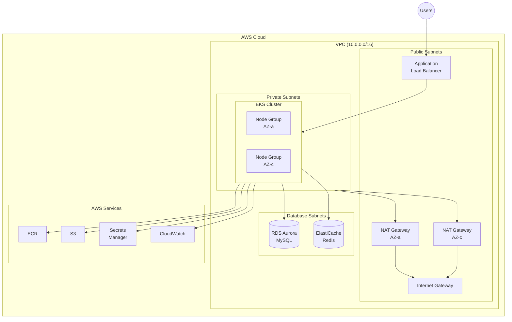
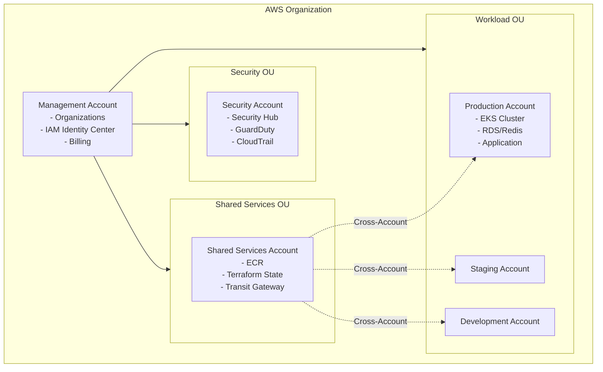
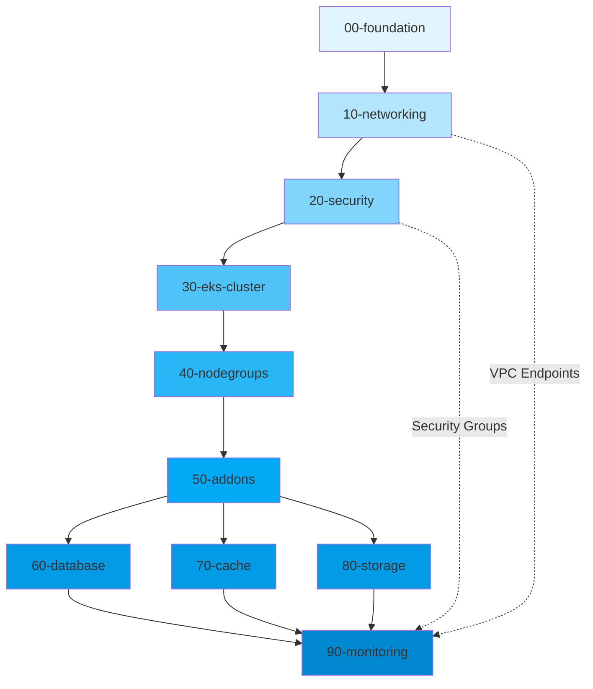
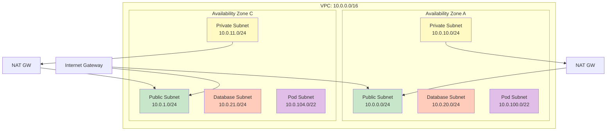
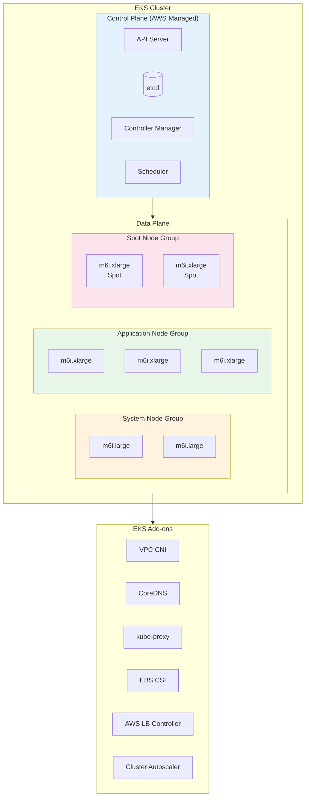
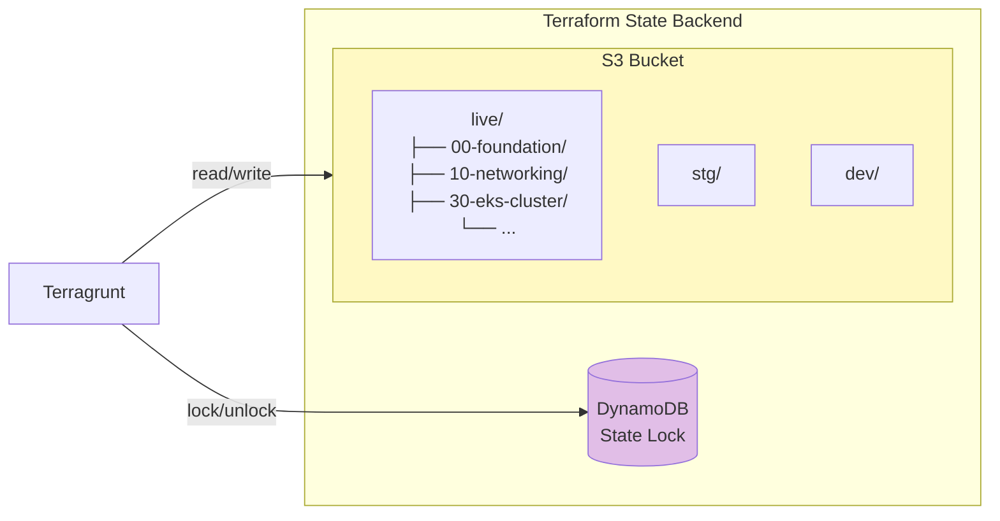
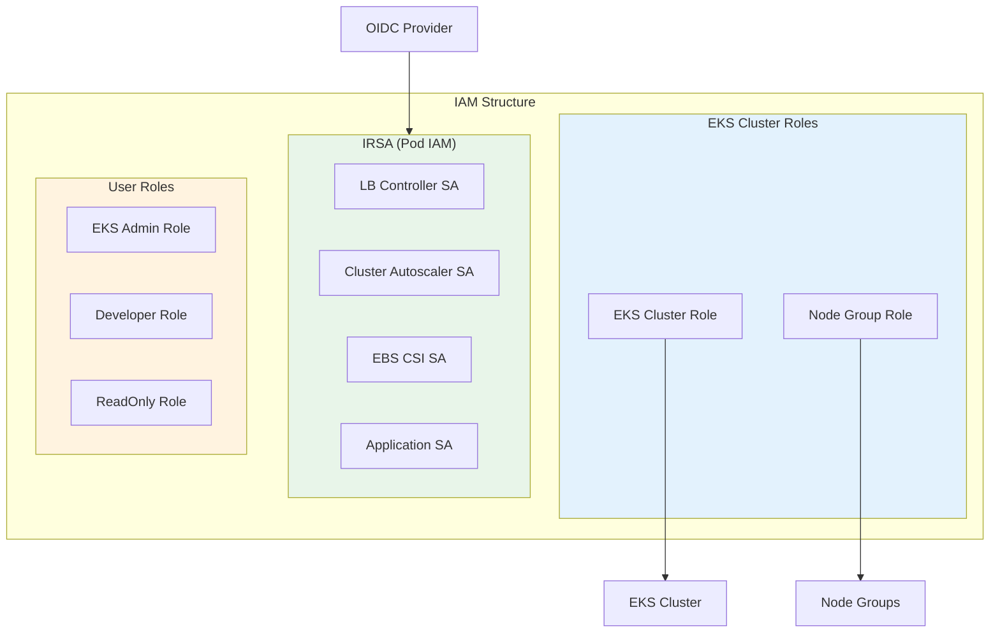
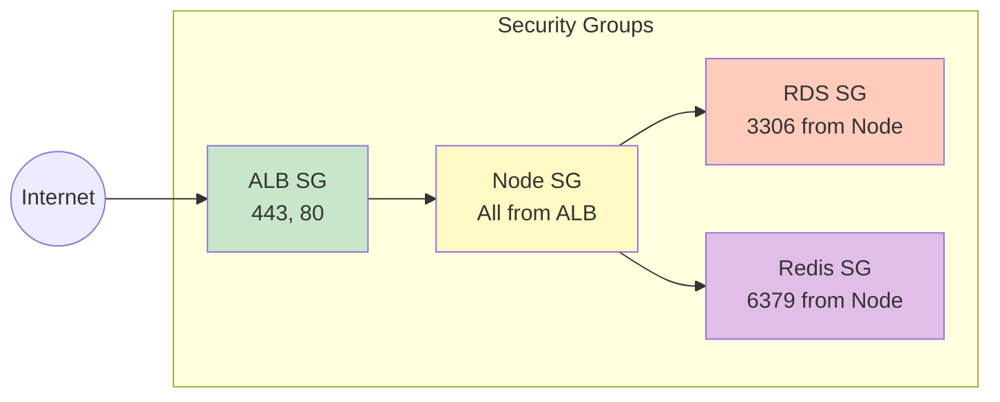
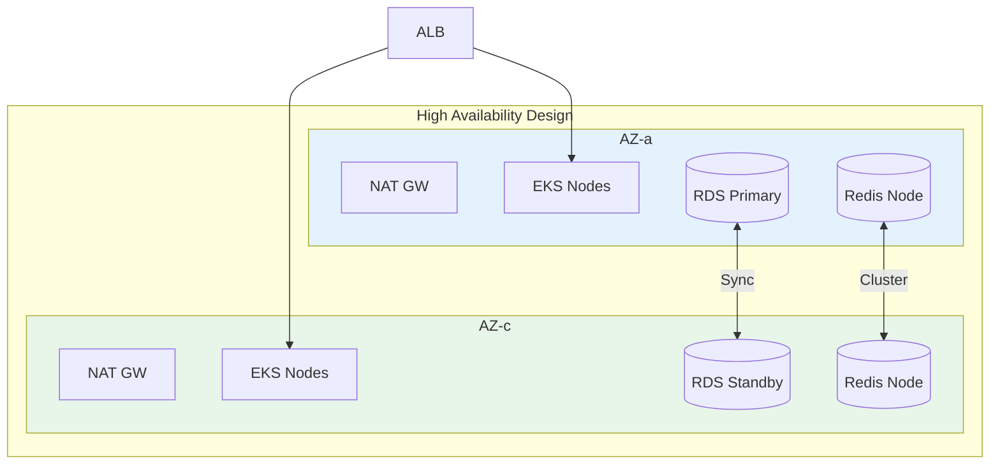

# 아키텍처 설계

AWS EKS 인프라의 전체 아키텍처를 설명합니다.

## 인프라 개요



## 멀티 어카운트 구조



## 레이어 구조

### 배포 순서 및 의존성



### 레이어별 설명

| 레이어 | 목적 | 주요 리소스 |
| ------ | ---- | ----------- |
| 00-foundation | AWS 기본 설정 | IAM, KMS, S3 State Bucket |
| 10-networking | 네트워크 인프라 | VPC, Subnet, NAT GW, Route Table |
| 20-security | 보안 설정 | Security Group, IAM Role, IRSA |
| 30-eks-cluster | EKS 컨트롤 플레인 | EKS Cluster, OIDC Provider |
| 40-nodegroups | 워커 노드 | Node Group, Launch Template |
| 50-addons | EKS 애드온 | VPC CNI, CoreDNS, kube-proxy |
| 60-database | 데이터베이스 | RDS, Parameter Group |
| 70-cache | 캐시 | ElastiCache Redis |
| 80-storage | 스토리지 | EBS CSI, EFS, S3 |
| 90-monitoring | 모니터링 | CloudWatch, Prometheus |

## 네트워크 설계

### VPC 구성도



### 서브넷 구성

| 서브넷 유형 | CIDR | 용도 |
| ----------- | ---- | ---- |
| Public | 10.0.0.0/24, 10.0.1.0/24 | NAT GW, ALB, Bastion |
| Private | 10.0.10.0/24, 10.0.11.0/24 | EKS 워커 노드 |
| Database | 10.0.20.0/24, 10.0.21.0/24 | RDS, ElastiCache |
| Pod | 10.0.100.0/22, 10.0.104.0/22 | EKS Pod (CNI Custom) |

### EKS 서브넷 태그

```hcl
# Public Subnet
"kubernetes.io/role/elb" = "1"
"kubernetes.io/cluster/${cluster_name}" = "shared"

# Private Subnet
"kubernetes.io/role/internal-elb" = "1"
"kubernetes.io/cluster/${cluster_name}" = "shared"
```

## EKS 클러스터 구성



## State 관리



## 보안 설계

### IAM 구조



### 네트워크 보안



## 고가용성



### 고가용성 체크리스트

- Multi-AZ 배포 (최소 2개 AZ)
- EKS 컨트롤 플레인: AWS 관리형 HA
- 워커 노드: 다중 AZ Node Group
- RDS: Multi-AZ 옵션
- ElastiCache: Cluster Mode 활성화
- NAT Gateway: AZ별 배치
