# 아키텍처 설계

AWS EKS 인프라의 전체 아키텍처를 설명합니다.

## 인프라 개요

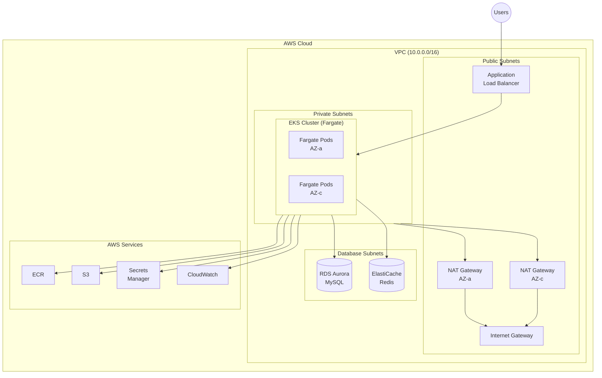

## 멀티 어카운트 구조 (AWS Landing Zone)

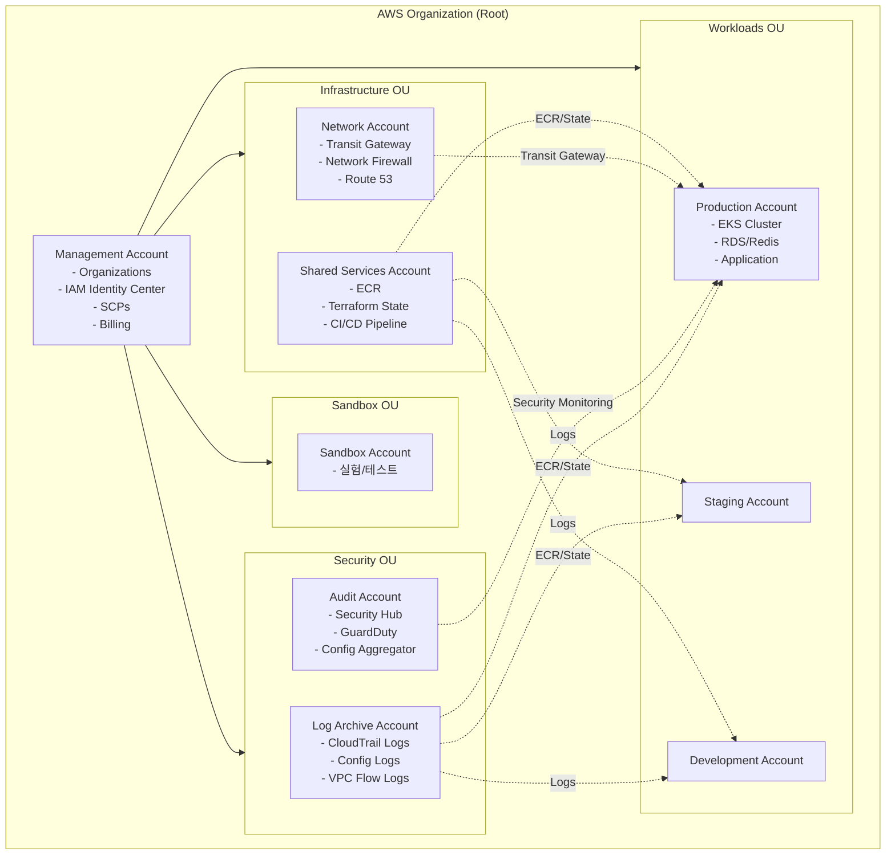

### 계정별 역할

| 계정 | OU | 주요 역할 |
| ---- | -- | --------- |
| Management | Root | Organizations, IAM Identity Center, SCPs, Billing |
| Log Archive | Security | 중앙 로그 저장 (CloudTrail, Config, Flow Logs) |
| Audit | Security | 보안 모니터링 (Security Hub, GuardDuty) |
| Network | Infrastructure | 네트워크 허브 (Transit Gateway, Firewall) |
| Shared Services | Infrastructure | 공유 리소스 (ECR, State, CI/CD) |
| Sandbox | Sandbox | 개발자 실험 환경 |
| Production | Workloads | 프로덕션 워크로드 |
| Staging | Workloads | 스테이징 환경 |
| Development | Workloads | 개발 환경 |

## 레이어 구조

### 배포 순서 및 의존성

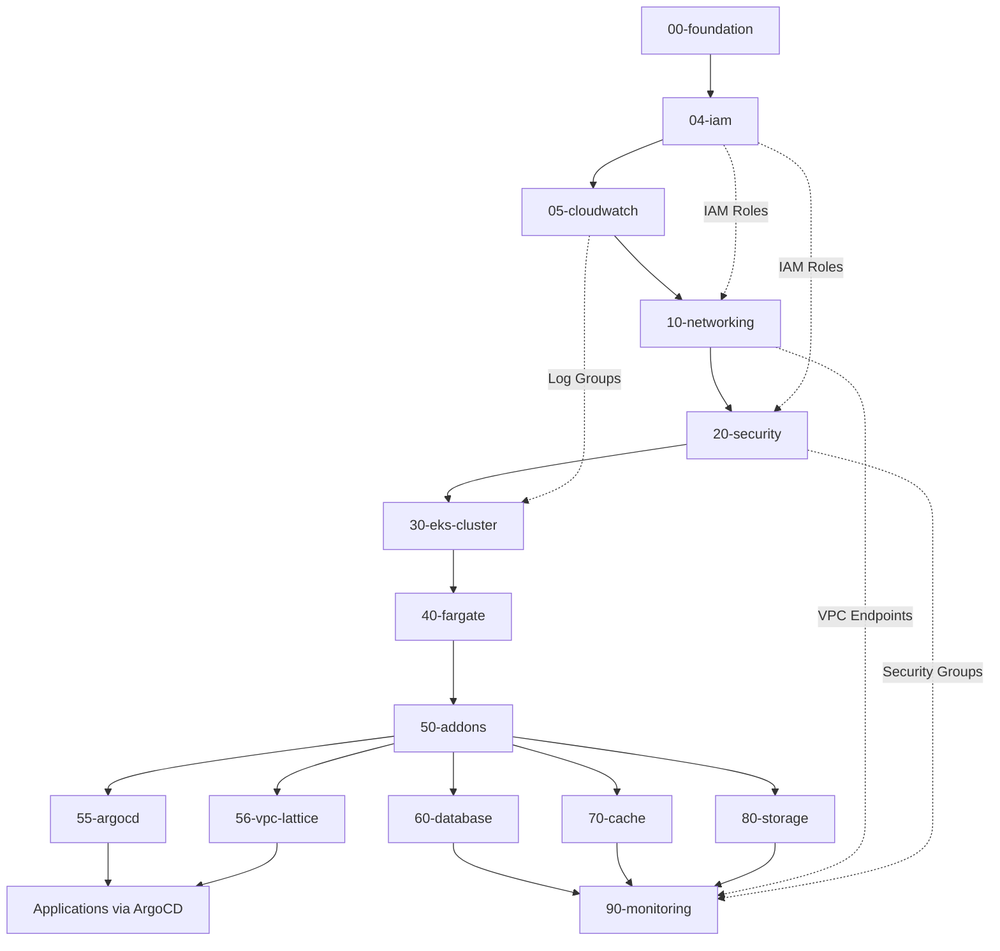

### 레이어별 설명

| 레이어 | 목적 | 주요 리소스 |
| ------ | ---- | ----------- |
| 00-foundation | AWS 기본 설정 | KMS, S3 State Bucket |
| 04-iam | IAM 역할 중앙 관리 | EKS Cluster Role, Fargate Pod Execution Role, Flow Logs Role, RDS Monitoring Role |
| 05-cloudwatch | CloudWatch 로그 그룹 | EKS, ECS, EC2, Lambda, VPC Log Groups |
| 10-networking | 네트워크 인프라 | VPC, Subnet, NAT GW, Route Table |
| 20-security | 보안 설정 | Security Group |
| 30-eks-cluster | EKS 컨트롤 플레인 | EKS Cluster, OIDC Provider |
| 40-fargate | Fargate Profiles | System, Application, Monitoring Profiles |
| 50-addons | EKS 애드온 | VPC CNI, CoreDNS, kube-proxy, IRSA |
| 55-argocd | GitOps CD | ArgoCD (Helm), App of Apps |
| 56-vpc-lattice | 서비스 메시 | VPC Lattice Service Network, Services, Target Groups |
| 60-database | 데이터베이스 | RDS, Parameter Group |
| 70-cache | 캐시 | ElastiCache Redis |
| 80-storage | 스토리지 | EBS CSI, EFS, S3 |
| 90-monitoring | 모니터링 | CloudWatch, Prometheus |

## 네트워크 설계

### VPC 구성도

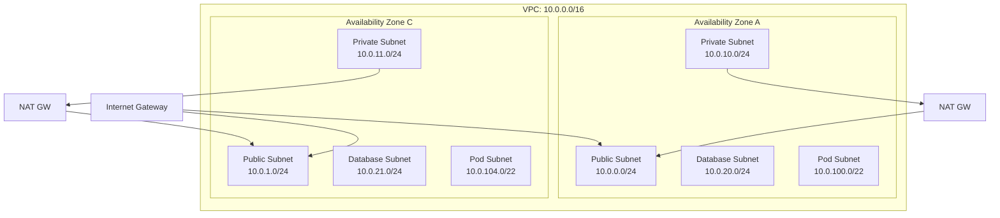

### 서브넷 구성

| 서브넷 유형 | CIDR | 용도 |
| ----------- | ---- | ---- |
| Public | 10.0.0.0/24, 10.0.1.0/24 | NAT GW, ALB, Bastion |
| Private | 10.0.10.0/24, 10.0.11.0/24 | EKS Fargate Pods |
| Database | 10.0.20.0/24, 10.0.21.0/24 | RDS, ElastiCache |
| Pod | 10.0.100.0/22, 10.0.104.0/22 | EKS Pod (CNI Custom) |

### EKS 서브넷 태그

```hcl
# Public Subnet
"kubernetes.io/role/elb" = "1"
"kubernetes.io/cluster/${cluster_name}" = "shared"

# Private Subnet
"kubernetes.io/role/internal-elb" = "1"
"kubernetes.io/cluster/${cluster_name}" = "shared"
```

## EKS 클러스터 구성 (Fargate 전용)

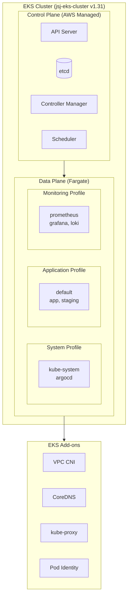

### Fargate Profile 설정

| Profile | Namespace | 용도 |
| ------- | --------- | ---- |
| system | kube-system, argocd | 시스템 컴포넌트 |
| application | default, app, staging | 애플리케이션 워크로드 |
| monitoring | prometheus, grafana, loki | 모니터링 (선택적) |

### 현재 EKS 애드온

| 애드온 | 상태 | 비고 |
| ------ | ---- | ---- |
| vpc-cni | Active | Fargate 네트워킹 |
| coredns | Active | Fargate에서 실행 |
| kube-proxy | Active | DaemonSet |
| eks-pod-identity-agent | Active | IRSA 대체 |

### AWS Load Balancer Controller

AWS Load Balancer Controller는 Kubernetes Ingress/Service를 AWS ALB/NLB로 프로비저닝합니다.

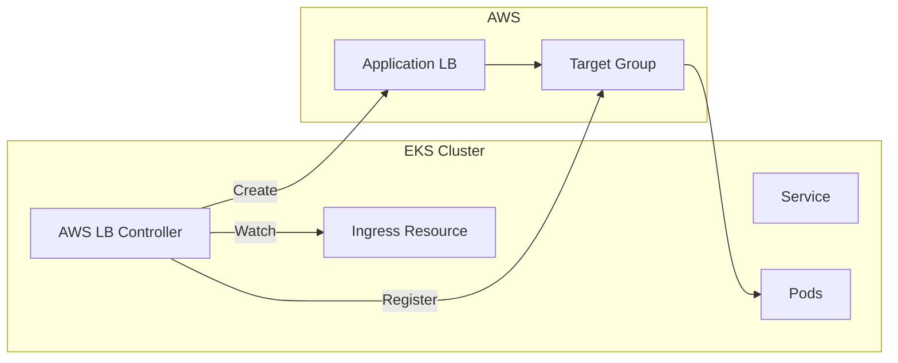

| 항목 | 설정 |
| ---- | ---- |
| 설치 방식 | Helm (Terraform 관리) |
| IAM 연동 | IRSA (OIDC) |
| Ingress Class | alb |
| Target Type | ip (Fargate 필수) |

### ArgoCD (GitOps)

ArgoCD는 GitOps 방식으로 Kubernetes 애플리케이션을 배포합니다.

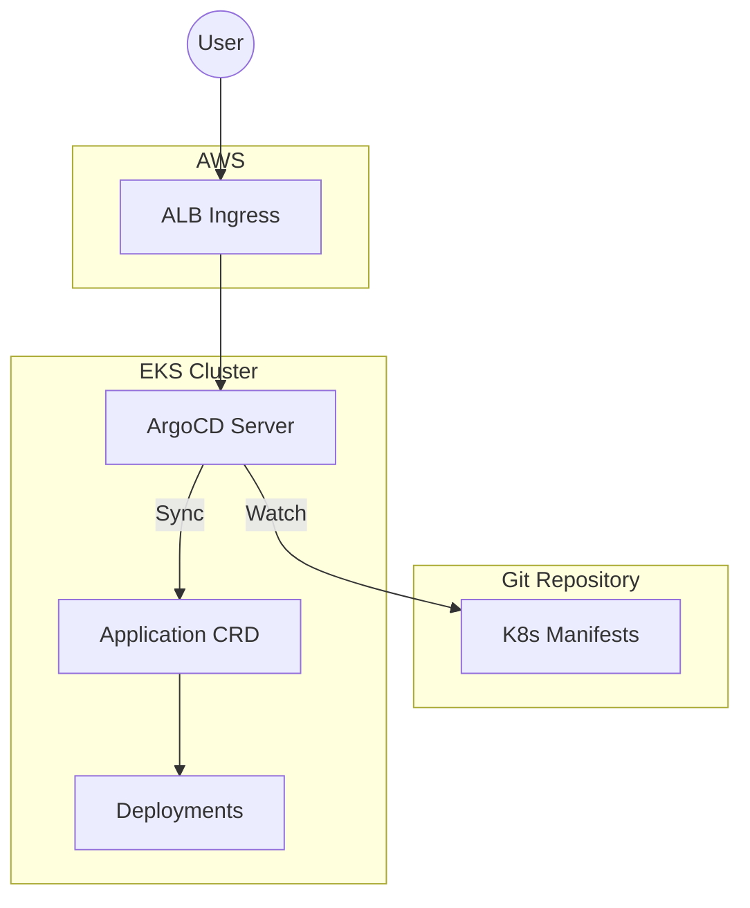

| 항목 | 설정 |
| ---- | ---- |
| 네임스페이스 | argocd |
| 설치 방식 | Helm (Terraform 관리) |
| 외부 접속 | ALB Ingress (Host: *) |
| Ingress 관리 | Terraform kubernetes_ingress_v1 |

## State 관리

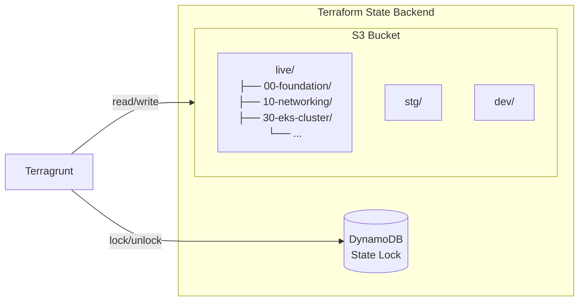

## 보안 설계

### IAM 구조

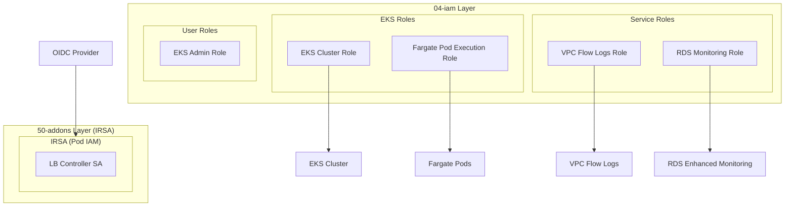

### 네트워크 보안

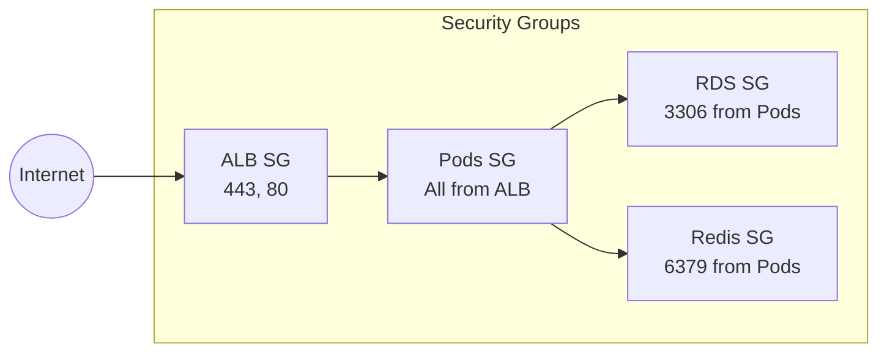

## 고가용성

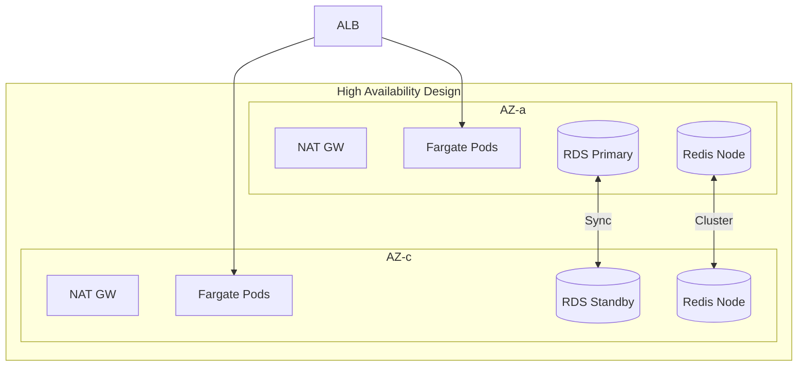

### 고가용성 체크리스트

- Multi-AZ 배포 (최소 2개 AZ)
- EKS 컨트롤 플레인: AWS 관리형 HA
- Fargate: 다중 AZ 자동 분산
- RDS: Multi-AZ 옵션
- ElastiCache: Cluster Mode 활성화
- NAT Gateway: AZ별 배치
